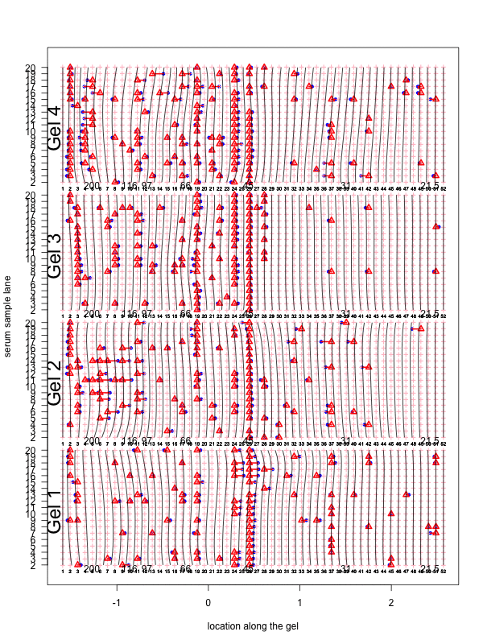
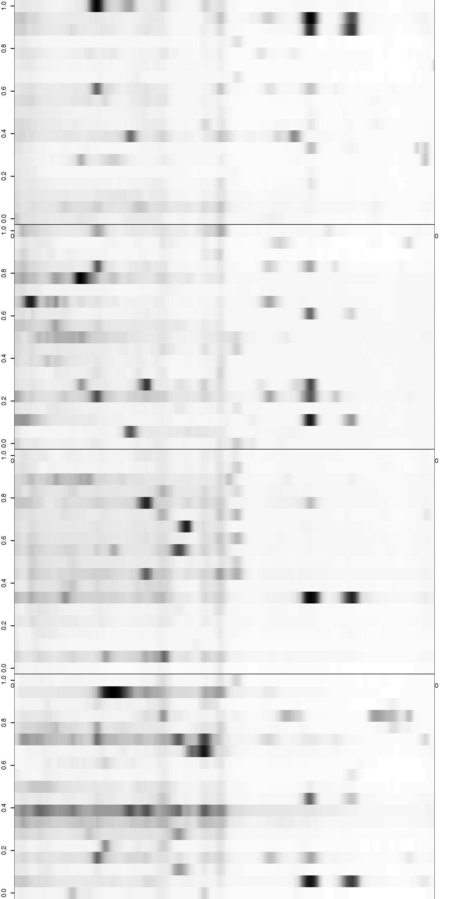

# **spotgear**: Subset Profiling and Organizing Tools for Gel Electrophoresis Autoradiography in R
### An R Package for Fitting Bayesian Two-Dimensional Image Dewarping Models and Estimating Disease Subsets and Signatures

--------
**Maintainer**: Zhenke Wu, zhenkewu@umich.edu

**License**: MIT + file LICENSE

**References**: If you are using **spotgear** for the preprocessing of gel electrophoresis autoradiographic imaging data, please cite the following paper:

|       | Citation     | Paper Link
| -------------  | -------------  | -------------  |
| spotgear for GEA data    | Wu Z, Casciola-Rosen L, Shah, AA, Rosen A, Zeger SL (2017+). **Estimating AutoAntibody Signatures to Detect Autoimmune Disease Patient Subsets**.   |[Link](http://www.biorxiv.org/content/early/2017/08/04/128199)| 

## Table of content
- [1. Introduction](#id-section1)
- [2. Software](#id-section2)
- [3. Visualization](#id-section3)

## 1. Introduction

Autoimmune diseases, e.g., scleroderma, are human immune system’s
responses to autoantigens in which the body produces specific autoantibodies
that target these autoantigens but also cause tissue damage. The autoantibody
composition is strikingly different among patients, as indicated by the many
different radiolabeled patterns obtained from the mass-spectrometry-based
technology - gel electrophoresis autoradiograms (GEA). Human recognition of
patterns is not optimal when the patterns are composite/complex, or patterns
are scattered across a large number of sam- ples. However, multiple sources of
error (including irrelevant intensity differences across gels and warping of
the gels) have traditionally precluded automation of pattern discovery using
autoradiograms. In this package, we overcome these limitations by novel initial
gel data preprocessing (Bayesian two dimensional image dewarping/registration) and then provide methods to
detect disease subgroups.

We recommend to use the spotgear 2d Bayesian dewarping method for GEA data pre-processing prior to statistical analysis. 

## 2. Software

**Tutorials, instructions and examples for using spotgear:**
- [R code examples; to come]()

## 3. Visualization

### Animation of Fitted Bayesian Dewarping Result

**Figure 1**: Correction for smooth non-rigid gel deformation. Shown here are, for each gel batch, 19 serum lanes at 50 interior molecular weight grid points with large and small weights toward the left and right, respectively. Solid blue dots are detected peaks deviating from its true weight. Each detected peak is connected to a red triangle that represents the most likely actual molecular weight landmark. The black vertical curves together show the deformation, with each black vertical curve connecting locations with identical molecular weights. The curves are drawn for each grid point.

### Heatmap of Aligned Gels

**Figure 2**: Visualization of the *aligned* gels given a fitted warping function S. For each sample lane, given a set of peak-to-landmark alignment indicator, the dewarping model maps the observed peaks to the landmark locations. Assuming at least one peak is detected, we then perform piecewise linear compression or stretching anchoring at matched landmarks along with two endpoint landmarks. The approximation is in general slightly different from the smooth function S. One can view the Bayesian dewarping model based on landmarks as first estimating S using downsampled landmarks to encourage nearby peaks to be aligned. Once the peak-to-landmark indicators are estimated, we use them for obtaining the piecewise linear approximation to S. In this figure, we used *maximum a posteriori* estimates of the peak-to-landmark indicators to construct this approximation, which gives visually excellent vertical alignment of black bands. 

------
